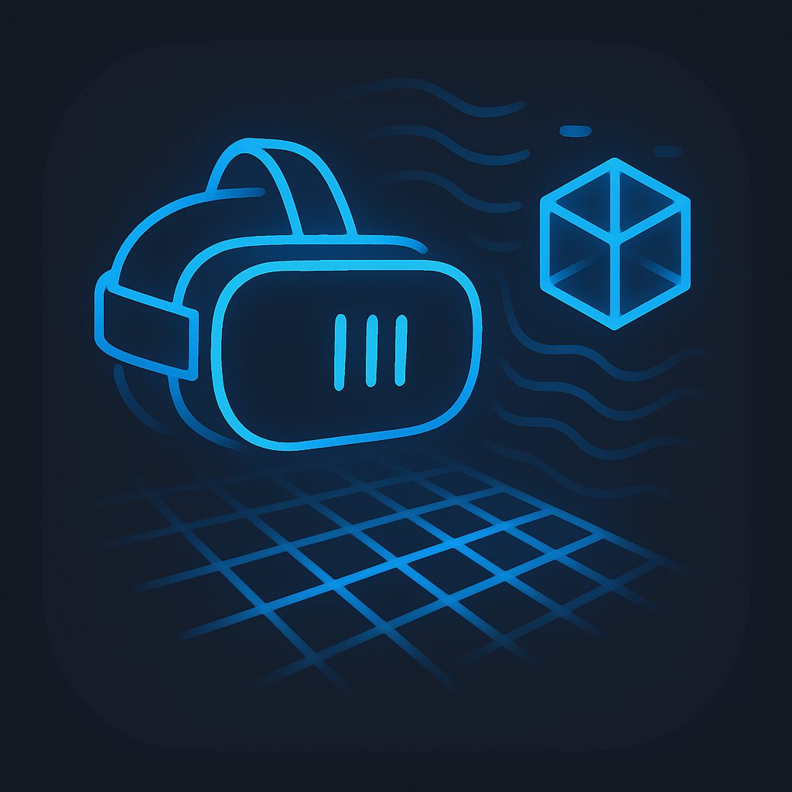

# GARTSS — Generative AR Task Support System

**Zero-shot AR Authoring for Quest 3**

Quest 3 のパススルーカメラ（RGB + Depth API）を使い、現実空間の物体を自動認識して AR コンテンツを配置するシステムのクライアント側 Unity プロジェクトです。



## コンセプト

従来の AR オーサリングでは、対象物体ごとに手動でマーカー登録や 3D モデル配置が必要でした。GARTSS は **PDF マニュアルと 3D モデルから AR アプリケーションを自動生成** し、AR コンテンツ制作時間を 90% 以上削減することを目指しています。

### データフロー

```
[Quest 3]
  Depth API → RenderTexture (GPU)
       ↓ AsyncGPUReadback
  Camera2 API → RGB 画像 (1280×1280)
       ↓ UnityWebRequest POST
  [GARTSS Server]
       ↓ RGB-Depth 3D 再投影アライメント
       ↓ Gemini API → 物体検出 (BBox)
       ↓ SAM2 → セグメンテーション → 3D 輪郭
       ↓ JSON レスポンス
  [Quest 3]
       ↓ ARContentPlacer
  3D 空間にオブジェクトを配置
```

**ローカルストレージへの書き込みはゼロ。** すべてメモリ上で処理し、サーバーへ直接送信します。

## システム構成

| コンポーネント | リポジトリ | 技術 |
|---|---|---|
| **クライアント** | [GARTSS](https://github.com/packet-chan/GARTSS) (本リポジトリ) | Unity 6, C#, Meta XR SDK, OpenXR |
| **サーバー** | [GARTSS_Server](https://github.com/packet-chan/GARTSS_Server) | Python, FastAPI, NumPy/SciPy, Gemini API, SAM2 |

## 動作要件

| 項目 | バージョン |
|---|---|
| Unity | 6000.0.67f1 |
| Meta XR SDK | com.meta.xr.sdk.interaction.ovr 76.0.0 |
| OpenXR | com.unity.xr.openxr 1.16.1 + com.unity.xr.meta-openxr 2.1.0 |
| URP | com.unity.render-pipelines.universal 17.0.4 |
| Quest 3 | v76 以降 |
| ビルドターゲット | Android (ARM64, IL2CPP, API Level 32+) |

## プロジェクト構成

```
Assets/
├── GARTSS/
│   ├── Scripts/
│   │   ├── SessionInitializer.cs      # カメラ許可取得後にセッション初期化
│   │   ├── CaptureOrchestrator.cs     # Depth + RGB キャプチャ → サーバー送信
│   │   ├── GARTSSClient.cs            # HTTP 通信クライアント
│   │   ├── RGBCameraCapture.cs        # Camera2 API 経由の RGB 取得
│   │   ├── CaptureButton.cs           # コントローラー入力ハンドラ
│   │   ├── ARContentPlacer.cs         # 検出結果の 3D 配置
│   │   └── ServerModels.cs            # サーバー API の JSON 型定義
│   ├── Scenes/
│   │   └── GARTSSScene.unity          # メインシーン
│   └── Prefabs/
│       ├── Marker.prefab              # AR マーカー Prefab
│       ├── OVRCameraRig Variant.prefab
│       └── PassthroughCamera.prefab
│
├── RealityLog/                        # 既存ライブラリ (変更なし)
│   ├── Scripts/Runtime/
│   │   ├── Camera/                    # CameraPermissionManager 等
│   │   └── Depth/Meta/               # DepthDataExtractor, DepthFrameDesc
│   └── ComputeShaders/
│       └── CopyDepthMap.compute       # Depth GPU Readback 用
│
├── Plugins/Android/
│   ├── AndroidManifest.xml            # CAMERA + INTERNET パーミッション
│   └── questcameralib.aar            # Camera2 API Java ラッパー
│
└── Resources/
    └── CopyDepthMap.compute           # Resources.Load 用コピー
```

## スクリプト解説

### SessionInitializer

`CameraPermissionManager` のカメラ情報が利用可能になるのを待ち、`CaptureOrchestrator.InitializeSession()` を呼び出してサーバーとのセッションを開始します。RGB カメラ（Camera2 API）の初期化もここで行います。

### CaptureOrchestrator

システムの中核。以下の処理をコルーチンで順番に実行します：

1. `OnBeforeRender` コールバック内で Depth API からフレーム取得（`DepthDataExtractor`）
2. ComputeShader + `AsyncGPUReadback` で Depth NDC バッファを CPU に読み出し
3. `ImageReaderSurfaceProvider` 経由で RGB 画像を一時ファイルとして取得
4. HMD ポーズバッファから Depth タイムスタンプに近いポーズを抽出
5. すべてをまとめてサーバーに POST

タイムスタンプ変換（OVR 時間 → Unix 時間）やポーズバッファリング（FixedUpdate で 50 フレーム保持）も担当します。

### GARTSSClient

FastAPI サーバーとの HTTP 通信を管理します。

| メソッド | エンドポイント | 内容 |
|---|---|---|
| `InitSession` | POST `/session/init` | カメラパラメータ送信、セッション ID 取得 |
| `SendCapture` | POST `/session/{id}/capture` | RGB + Depth + HMD ポーズ送信 (multipart) |
| `RequestAnalyze` | POST `/session/{id}/analyze` | Gemini + SAM2 による物体検出要求 |
| `QueryDepth` | GET `/session/{id}/depth?u=&v=` | ピクセル座標 → Depth / 3D 座標クエリ |

### ARContentPlacer

サーバーから返された `AnalyzeResponse` の 3D 座標に Prefab を Instantiate して AR 空間に配置します。B ボタンで全クリア可能。

## セットアップ

詳細は [SETUP_GUIDE.md](SETUP_GUIDE.md) を参照してください。概要は以下の通りです：

### 1. リポジトリのクローン

```bash
git clone https://github.com/packet-chan/GARTSS.git
```

Unity Hub → Add project from disk → Unity 6000.0.67f1 で開く。

### 2. Project Settings の確認

- **XR Plug-in Management (Android)**: OpenXR 有効
- **OpenXR Features**: Meta Quest Passthrough + Occlusion 有効、Render Mode: Multi-pass
- **Player Settings**: IL2CPP, ARM64, API Level 32+

### 3. AndroidManifest.xml

`Assets/Plugins/Android/AndroidManifest.xml` に以下が含まれていることを確認：

```xml
<uses-permission android:name="android.permission.CAMERA"/>
<uses-permission android:name="horizonos.permission.HEADSET_CAMERA"/>
<uses-permission android:name="android.permission.INTERNET"/>
<uses-permission android:name="android.permission.ACCESS_NETWORK_STATE"/>
```

### 4. サーバー起動

```bash
git clone https://github.com/packet-chan/GARTSS_Server.git
cd GARTSS_Server
pip install -r requirements.txt
uvicorn server:app --host 0.0.0.0 --port 8000
```

### 5. ビルド & デプロイ

1. `GARTSSClient` の Server URL に PC のローカル IP を設定
2. File → Build Settings → Android → Build and Run
3. Quest 3 を USB 接続して自動インストール

## 操作方法

| ボタン | 動作 |
|---|---|
| **A ボタン** | キャプチャ → サーバーで Analyze → AR オブジェクト配置 |
| **B ボタン** | 配置済み AR オブジェクトを全クリア |

## シーン階層

```
GARTSSScene
├── XR Origin
│   ├── Camera Offset
│   │   ├── Main Camera
│   │   ├── Left Controller
│   │   └── Right Controller
│   └── OVR Manager
├── PassthroughLayer          [OVR Passthrough Layer]
├── CameraManager             [CameraPermissionManager]
└── GARTSSManager             [GARTSSClient]
                              [CaptureOrchestrator]
                              [ARContentPlacer]
                              [SessionInitializer]
                              [CaptureButton]
```

## サーバー API 仕様

サーバー側の詳細は [GARTSS_Server](https://github.com/packet-chan/GARTSS_Server) を参照してください。

| Method | Path | 説明 |
|---|---|---|
| POST | `/session/init` | セッション初期化 (カメラパラメータ) |
| POST | `/session/{id}/capture` | RGB + Depth 受信 → 3D 再投影アライメント |
| GET | `/session/{id}/depth?u=&v=` | ピクセル → Depth / 3D 座標クエリ |
| POST | `/session/{id}/analyze` | Gemini + SAM2 による物体検出・セグメンテーション |
| PUT | `/session/{id}/task` | 検出タスクの変更 |
| GET | `/session/{id}/info` | セッション状態 |
| DELETE | `/session/{id}` | セッション削除 |
| GET | `/health` | ヘルスチェック |

## 技術的なポイント

### RGB-Depth アライメント

Quest 3 の Depth API（環境 Depth）と Camera2 API（パススルー RGB カメラ）は異なるセンサー・座標系のため、3D 再投影で正確にアライメントしています。

```
Depth NDC → リニア変換 → Depth カメラ 3D → ワールド 3D → RGB カメラ 3D → RGB ピクセル
```

座標変換は Unity ↔ Open3D 間の変換（Y 軸反転、Z 軸反転）を正確に処理しています。

### タイムスタンプ同期

Depth フレームと HMD ポーズのタイムスタンプ体系が異なるため（OVR 時間 vs Unix 時間）、起動時に基準点を記録し、相対時間で変換しています。HMD ポーズは FixedUpdate で 50 フレーム分バッファリングし、Depth タイムスタンプ ±200ms の範囲から補間取得します。

### GPU → CPU Readback

Depth データは GPU 上の RenderTexture として提供されるため、ComputeShader (`CopyDepthMap.compute`) で GraphicsBuffer にコピーし、`AsyncGPUReadback` で非同期に CPU 側に読み出しています。

## 今後の開発予定

- [ ] PDF マニュアル解析 → タスクシーケンス自動生成パイプライン
- [ ] ステップバイステップの AR ガイダンス UI
- [ ] 複数物体の同時検出・追跡
- [ ] LLM ベースの認知フィルタリング（タスク難易度に応じた情報量調整）

## ライセンス

MIT License

## 関連リポジトリ

- [GARTSS_Server](https://github.com/packet-chan/GARTSS_Server) — Python サーバー (FastAPI + Gemini + SAM2)
- [QuestRealityCapture](https://github.com/t-34400/QuestRealityCapture) — ベースとなった Quest 3 カメラキャプチャライブラリ
